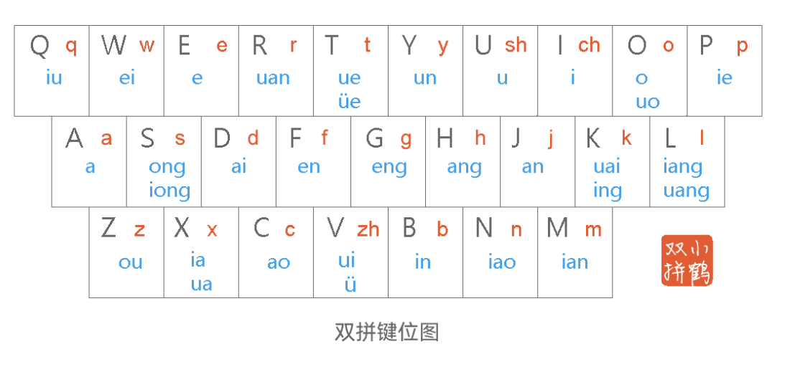
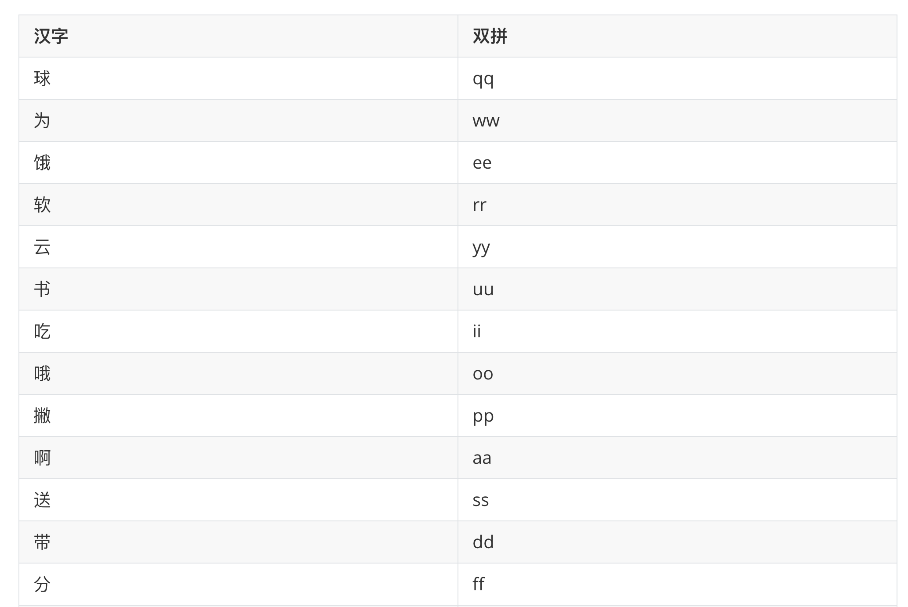
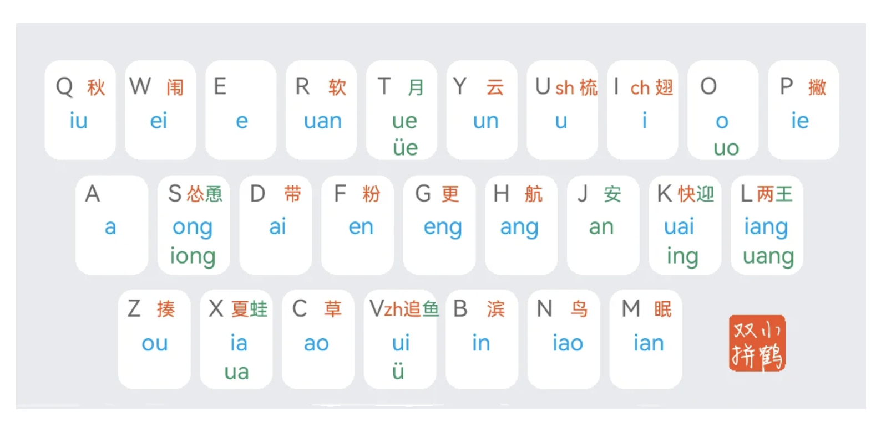
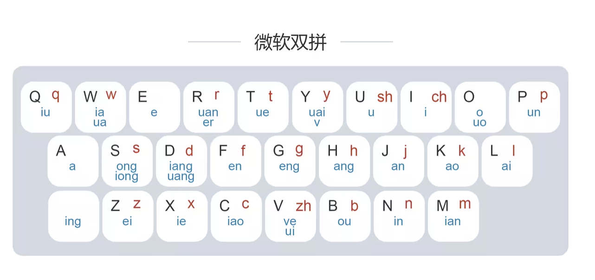
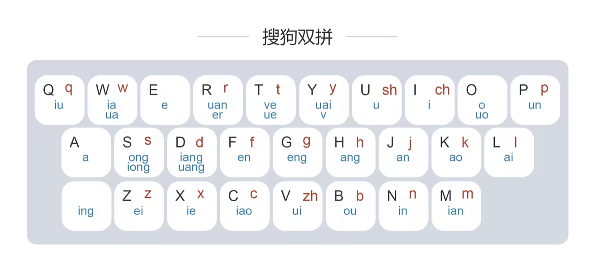

## 双拼输入法

###### 吕庆睿 · 2026.3.30

---

## 📌 核心原理

用一个字母表示声母，一个字母表示韵母，每个字都只要两个字母就可以表示。

--

### 双拼

<small>来源：https://flypy.cc/</small>

--

### 双拼示例

“双拼” 👇

双 → sh + uang → u + l  
拼 → p + in → p + b

全拼：shuangpin（9键）  
双拼：ulpb（4键） 🚀

--

"今天晚上一起吃火锅吗"

小鹤双拼 → jt ws yh yi qi ih ho go ma (32 个字母) 
全拼 → jintianwanshangyiqichihuoguoma (18 个字母)

---

## 😋双拼的好处

- 比全拼的打字速度快很多 🚀
- 减少按键次数 🤩

--

## ⚡ 双拼 vs 五笔

- 五笔：速度更快，但学习成本高（形码）
- 双拼：基于拼音，上手更容易（音码）

- 五笔：生僻字输入更有优势
- 双拼：日常输入效率不输五笔

---

## 🧠 学习成本

👉 只需要记忆键位  

<small>来源：https://flypy.cc/</small>

--

## 记忆小窍门

--

--

## 打字练习

[练习1](https://api.ihint.me/shuang/): https://api.ihint.me/shuang/  
[练习2](https://www.keyspell.top/writer/): https://www.keyspell.top/writer/

---

## 🎯 常见双拼方案

--

1. 小鹤双拼
   
   <small>来源：https://flypy.cc/help/#/vy</small>

--

2. 微软双拼
   
   <small>来源：https://www.bilibili.com/read/cv12280890/</small>

--

3. 搜狗双拼
   
   <small>来源：https://www.bilibili.com/read/cv12280890/</small>

---

# 🙏 谢谢！
